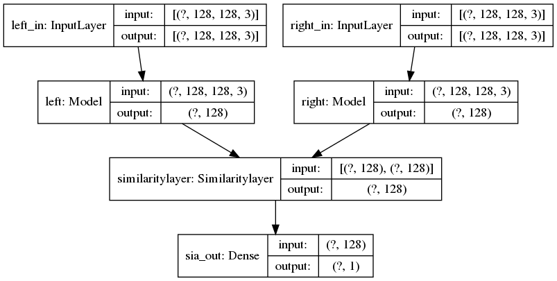
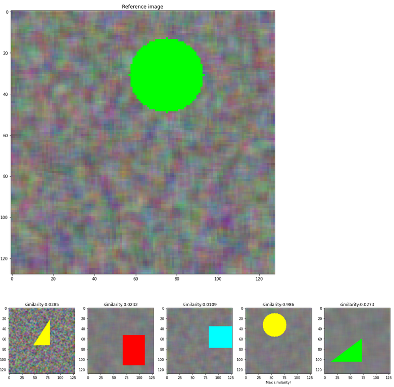
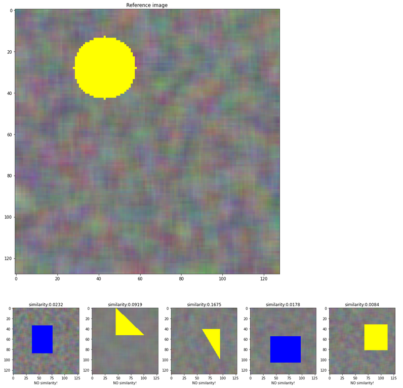

# Shape similarity identification with siamese network

Learning from a few samples is a difficult task in machine learning. The siamese network architecture provides a computationally reasonable way to check the similarity of sample pairs.

This implementation provides an example to test this concept, by generating a sample of pairs of similar and non-similar input images.

#### Steps:

1. Create a toy database, generate different shapes pairs
    label logic: 1 - similar shapes ; 0 - different shapes
2. Visualize data
3. Create the siamese model
4. Test similarity with the reference image

#### Model:

 
  

#### Outputs:

With high similarity:

 
  

With low similarity, below the threshold:

 
  

### References
1. [Siamese Neural Networks for One-shot Image Recognition, G Koch et al](https://www.cs.cmu.edu/~rsalakhu/papers/oneshot1.pdf)
2. [Few-Shot Learning with Siamese Networks and Label Tuning T Muller arXiv:2203.14655 [cs.CL]](https://doi.org/10.48550/arXiv.2203.14655)

/Enjoy.
